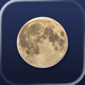
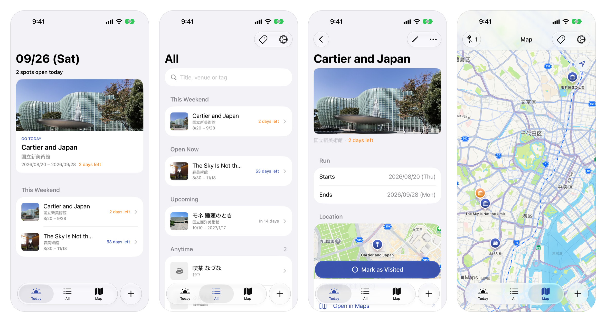

# Monaka 🥮

    

Monaka🥮 is the app for keeping the exhibitions, events and shops you want to visit on your days off — and catching them while they're still on.

A reminder has a *point* in time: "do it by this day". An exhibition has an *interval*: "you can go during this period". Monaka is a to-do list whose items have a run, sorted by how much of it is left — ending this weekend, ending soon, open now, upcoming — with a place for somewhere you can go anytime.

The name is the Japanese sweet 最中 (*monaka*). Read the other way, 最中 (*sanaka*) means "in the middle of" — the app is for going *while the run is still on*. The wafer's name comes from the full moon in 「水の面に照る月の最中」 (*Shūi Wakashū*), which is where the icon comes from.

## Features

- **Today** — one spot worth going to today, then This Weekend / Ending Soon / Open Now
- **All** — every spot sectioned by its run, with search, tag filters and distance sort
- **Map** — pins tinted by how much of the run is left, with each tag's own icon
- **Save from anywhere** — share a museum page, an Instagram post or a Google Maps place to Monaka
- **On-device reading** — Foundation Models reads the page for the venue, the run, a short summary and which of your tags fit, and the form marks what it guessed so you can check it
- A reminder three days before a run ends
- All data stays on-device via SwiftData

## Requirements

- Xcode 26.0+
- iOS 26.0+
- Apple Intelligence for the on-device reading (everything else works without it)
